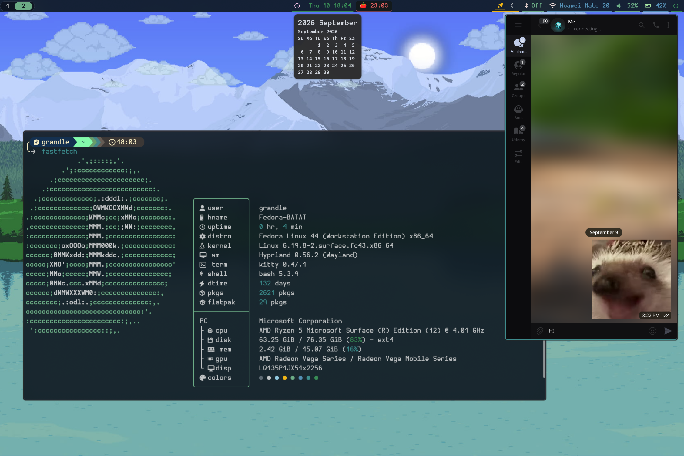

<div align="center">

# Grandle's Hyprland Rice

A minimal, Pywal-themed Hyprland setup with dynamic color schemes, custom menus, and built-in productivity tools.

**Hyprland · Waybar · Kitty · Fuzzel · Mako · Pywal**



</div>

---

## ✨ Features

- **Dynamic Theming:** Seamless Pywal integration for generating and applying color schemes across the system on the fly.
- **Built-in Pomodoro:** Integrated Pomodoro timer in the Waybar, complete with sound notifications (`libcanberra`) to keep you focused.
- **Telegram Side Window:** An opinionated, highly-tailored Telegram side window configuration for quick messaging access without breaking your workflow.
- **Custom Menus & App Launcher:** Fast and minimal menus powered by Fuzzel.

## 📦 Dependencies

To get the most out of this rice, ensure the following core packages are installed:

- **Core & Wayland:** `hyprland`, `hyprpaper`, `hyprlock`, `hypridle`, `xdg-desktop-portal-hyprland`, `kanshi`, `polkit-gnome`
- **UI & Theming:** `waybar`, `mako`, `fuzzel`, `wlogout`, `pywal`, `python-colorthief`, `yad`
- **Terminal & Utilities:** `kitty`, `pyprland`, `telegram-desktop`, `jq`, `libnotify`, `cliphist`, `wl-clipboard`
- **Media & System:** `pipewire`, `wireplumber`, `libpulse`, `networkmanager`, `bluez`, `blueman`, `brightnessctl`, `libcanberra`
- **Screenshot/Recording:** `grim`, `slurp`, `hyprshot`, `wf-recorder`, `imagemagick`

> [!TIP]
> Package names may vary depending on your Linux distribution.

### Fonts & Cursors
- **Fonts:** JetBrains Mono Nerd Font (System), Hurmit Nerd Font (Menus)
- **Cursor:** BreezeX-Black (Included in `MouseCursor/`)

## 🚀 Installation

> [!IMPORTANT]
> Please back up your existing configurations before proceeding.

1. **Clone the repository:**
   ```bash
   git clone https://github.com/Grandle74/dotfiles.git ~/dotfiles
   cd ~/dotfiles
   ```

2. **Apply configurations (Choose Option A or B):**

   **Option A: GNU Stow (Recommended)**  
   Symlink the configuration folders. This makes it easier to keep your dotfiles up-to-date:
   ```bash
   stow --adopt !(Wallpapers|MouseCursor|.preview|README.md)
   ```

   **Option B: Direct Copy**  
   If you prefer not to use symlinks, copy the directories directly:
   ```bash
   cp -r {Fuzzel,Hyprland,Kanshi,Kitty,Mako,Pypr,Wal,Waybar,Wlogout}/.config/* ~/.config/
   ```

3. **Install assets:**
   Copy the wallpapers and cursor theme to their respective directories so they can be read reliably:
   ```bash
   # Wallpapers
   mkdir -p ~/Pictures/.HyprPaper
   cp -r Wallpapers/Pictures/.HyprPaper/. ~/Pictures/.HyprPaper/
   
   # Cursor theme
   mkdir -p ~/.local/share/icons
   cp -r MouseCursor/.local/share/icons/BreezeX-Black ~/.local/share/icons/
   ```

## 🏁 First Run

Once installed, log into your Hyprland session:

1. Press `Super + Tab` to apply a random wallpaper and generate your first Pywal color scheme.
2. The Pywal cache will populate, automatically styling Waybar, Fuzzel, Mako, and Kitty.
3. Use `Super + Shift + K` to view all keybindings.

> [!NOTE]
> If Waybar or Fuzzel appear unstyled, reload Hyprland manually with `Super + Shift + R` after generating the color scheme.

---

<div align="center">
<sub>Feel free to fork and adapt!</sub>
</div>
